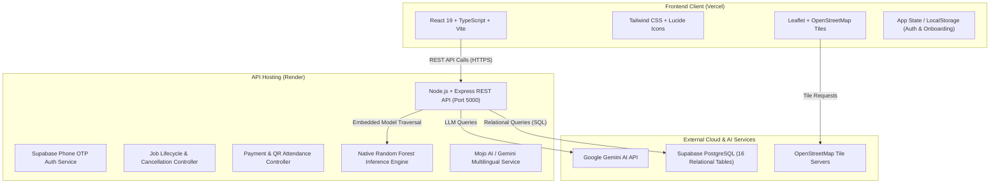

# WORK MOJO

> **AI-assisted cooperative platform connecting employers with verified blue-collar workers for on-demand gig and daily-wage work.**

[](https://react.dev/)
[](https://www.typescriptlang.org/)
[](https://nodejs.org/)
[](https://expressjs.com/)
[](https://supabase.com/)
[](https://leafletjs.com/)
[](https://vercel.com/)
[](https://render.com/)

---

## 🌐 Live Demo

- **Frontend Application (Vercel)**: [https://workmojozip.vercel.app/](https://workmojozip.vercel.app/)
- **Backend API Service (Render)**: [https://workmojozip.onrender.com](https://workmojozip.onrender.com)
- **API Base Endpoint**: `https://workmojozip.onrender.com/api/v1`
- **Health Check**: `https://workmojozip.onrender.com/health`

---

## 📌 About WorkMojo

**WorkMojo** is an AI-assisted employment and workforce coordination platform tailored for the unorganized daily-wage and blue-collar labor economy. It bridges informal labor markets with formal digital infrastructure, enabling individuals, households, and small business owners to discover, evaluate, and book reliable nearby workers with transparency, fair pay, and dignity.

### Target Stakeholders
- **Workers**: Carpenters, electricians, plumbers, construction laborers, warehouse loaders, cleaners, and transport assistants seeking regular local gigs without middleman commissions.
- **Employers / Customers**: Homeowners, shopkeepers, contractors, and event organizers requiring verified trade help on short notice with transparent wage expectations and reliable attendance.

### Why AI-Assisted Matching?
Informal labor hiring often fails because simple keyword search ignores practical realities: distance, trade nuances, shift schedules, past completion rates, and KYC verification. WorkMojo leverages machine learning and domain-weighted scoring to rank candidates on operational viability, while preserving complete human decision-making for the employer.

---

## 🎯 Problem Statement

Traditional hiring for daily-wage and informal gig work suffers from several recurring bottlenecks:

1. **Labor Fragmentation & Discovery**: Employers rely on word-of-mouth or roadside labor stands (*nakas/addas*), where skill level and availability are uncertain.
2. **Skill Mismatch**: General labor is frequently assigned to specialized tasks (e.g., masonry vs. plumbing), resulting in rework or abandoned shifts.
3. **Hyperlocal Distance & Commute Friction**: Workers cannot afford long, unpaid transit times for short half-day or single-day gigs.
4. **Availability Uncertainty**: Traditional directories lack live status (Available vs. Busy on another shift), causing high call abandonment.
5. **Lack of Structured Identity & Reputation**: Informal workers lack portable digital portfolios, verified trade backgrounds, and customer ratings.
6. **Payment Disputes & Wage Insecurity**: Cash-only deals often lead to wage withholdings, delayed settlements, or payment misunderstandings.

---

## 💡 Our Solution

WorkMojo digitizes the entire lifecycle of informal gig work through a structured, multi-step pipeline:

```
Employer Creates Job 
   ↓
Requirement Stored in Database (PostgreSQL / Supabase)
   ↓
Eligible Local Workers Identified (Trade, Distance, Availability)
   ↓
AI/ML Matching Engine Evaluates Suitability (Random Forest + Platform Governance)
   ↓
Candidates Ranked with Transparent Match Breakdown
   ↓
Employer Reviews Candidates & Confirms Worker
   ↓
Location Privacy Unlocked (Exact Address & Routing Revealed)
   ↓
QR Attendance Verification (Check-in / Check-out)
   ↓
Direct Payment Settlement (Online UPI or Cash Receipt)
   ↓
Two-Way Rating & Reputation Record
```

> **Human-in-the-Loop Principle**: The AI and ML layers only generate decision-support rankings. The employer retains final authority to review profiles, confirm workers, or cancel postings.

---

## 🚀 Key Features

All features listed below are verified and active in the repository:

### Worker Experience
- **Mobile Number Authentication**: Secure login and session restoration via phone authentication.
- **Onboarding & KYC Verification**: Multi-step identity verification including Aadhaar/Gov ID number capture and live photo verification before entering the active market.
- **Personalized Job Discovery**: Category-based browsing across 35 distinct trade categories with search and filter sheets (wage, distance, time of day).
- **One-Tap Job Application**: Quick application flow with instant waiting-list position assignment when slots are full.
- **Location Privacy Shield**: Obscured approximate area (2 km circle) displayed prior to booking; exact address unlocked only upon mutual confirmation.
- **Direct Payout Preferences**: Configure preferred payout method (Online UPI vs. Offline Direct Cash) with masked bank/UPI detail management.

### Employer Experience
- **Post Job Wizard**: 4-step job posting flow with category search, suggested wage baselines, scheduled timeframes, and worker headcount requirements.
- **Candidate Comparison & Ranking**: View applicant cards sorted by match probability with transparent sub-score breakdowns (Skills, Distance, Availability, Rating).
- **1-Click Auto-Selection**: Automatically confirms top-ranked candidates when speed is critical.
- **Job Cancellation Management**: Employers can cancel open, matching, or active shifts with authorization checks, triggering automated alerts to all applicants.
- **FIFO Waiting List**: If a confirmed worker drops out, the system promotes the top waiting-list candidate automatically.

### Operations, Trust & Safety
- **Interactive Leaflet Map**: Responsive OpenStreetMap integration displaying trade emoji pins, hourly wage badges, privacy circles, and routing lines.
- **Mojo AI Assistant**: Multilingual AI chatbot providing situational job recommendations, app navigation, and employment assistance.
- **Attendance via QR & Geofence**: QR check-in/out tracking to confirm on-site shift attendance.
- **Protected Payments & Receipts**: Payment state machine (`PENDING`, `AUTHORIZED`, `PAID`, `DISPUTED`) generating digital receipts with UTR tracking.
- **Two-Way Ratings**: Mutual star ratings (1.0–5.0) and written feedback updating worker and customer reliability profiles.
- **Safety Center**: Emergency SOS alert dispatch, user reporting, and blocking controls.
- **Multilingual Support**: Real-time localization across 4 languages: English (`en`), Telugu (`te`), Hindi (`hi`), and Tamil (`ta`).

---

## 🤖 AI & ML

### 1. Mojo AI Assistant
- **Primary AI Provider**: Powered by the Google Gemini API (`GEMINI_API_KEY`) on the server runtime.
- **Zero Client Leakage**: All AI requests route through the backend (`/api/v1/ai/chat`); API keys are never exposed in frontend bundles.
- **Multilingual Understanding**: Context-aware prompts preserve conversation history and respond in the user's selected language (English, Telugu, Hindi, Tamil).
- **Deterministic Domain Fallback**: If Gemini is offline, rate-limited, or unconfigured, an integrated domain engine parses natural language intents (e.g., "Find me an electrician", "Check payments") and responds with structured filter actions.

### 2. Worker–Job Matching Machine Learning
- **Model**: Scikit-Learn **Random Forest Classifier** (`n_estimators=100`, `max_depth=8`, `min_samples_split=4`, `min_samples_leaf=2`, `class_weight='balanced'`).
- **Features Used**:
  - `worker_skill_code`: Encoded worker trade category
  - `required_skill_code`: Encoded job trade requirement
  - `distance_km`: Hyperlocal distance between worker and job location
  - `job_type_code`: Job category classification
  - `rating`: Worker's historical customer rating (3.0 to 5.0)
  - `experience_years`: Years of on-the-job experience
  - `availability_code`: Live availability status (`Available`, `Busy`, `Away`)
  - `location_code`: Locality zone identifier
  - `skill_match`: Interaction indicator (1 if worker skill matches required skill, 0 otherwise)
- **Hybrid Production Scoring Formula**:
  $$\text{Final Score} = \left( 0.70 \times P(\text{match}=1) \times 100 \right) + \left( 0.30 \times S_{\text{domain}} \right)$$
  Combines the Random Forest match probability (70%) with operational platform metrics (30% for verified KYC, $\ge 95\%$ reliability score, shift completion volume, and proximity).

> **Important Validation Notice on Synthetic Data**:
> The prototype was evaluated on `work_mojo_synthetic_dataset_1000.csv` (1,000 synthetic records). In this dataset, the synthetic label was strictly driven by trade matching (`worker_skill == required_skill`), resulting in a reported **100% validation accuracy** on the held-out split. 
> 
> **This metric is an artifact of synthetic data heuristics and should NOT be interpreted as real-world production accuracy.** When `skill_match` was ablated in our audit (`server/ml/audit_model.py`), the model achieved **90.00% accuracy, 46.15% precision, 31.58% recall, and 87.21% ROC-AUC** across operational features. In live production, the model executes on real candidate records queried directly from Supabase.

---

## 🧠 ML Pipeline

```
Synthetic Dataset (1,000 rows, 11 columns)
   ↓
server/ml/train_model.py (Python 3, Scikit-Learn)
   ↓
Feature Preprocessing (Categorical encoding, interaction features, 80/20 stratified split)
   ↓
RandomForestClassifier Training (100 trees, max_depth=8)
   ↓
Model Export: server/src/ml/model_random_forest.json (258 KB portable JSON artifact)
   ↓
Zero-Dependency Node.js Inference Engine (server/src/ml/mlMatchingService.ts)
   ↓
Real-Time Evaluation (< 0.05 ms per candidate during Supabase queries)
```

- **Dataset**: `server/ml/data/work_mojo_synthetic_dataset_1000.csv`
- **Training Script**: `server/ml/train_model.py`
- **Audit Script**: `server/ml/audit_model.py` (Results stored in `server/ml/ml_audit_results.json`)
- **Runtime Deployment**: Portable JSON model artifact bundled directly into `server/dist/ml/`. Evaluates all 100 decision trees natively in Node.js, eliminating Python runtime overhead and container cold-starts on Render.

---

## 🏗️ System Architecture



---

## 🛠️ Technology Stack

| Layer | Technology | Version | Purpose in WorkMojo |
| :--- | :--- | :--- | :--- |
| **Frontend Framework** | React | `^19.2.8` | Component-driven user interface |
| **Language** | TypeScript | `~6.0.2` / `^5.8.2` | Full-stack static type safety across client and server |
| **Build Tool** | Vite | `^8.2.2` | Modern frontend bundler and HMR dev server |
| **Styling** | Tailwind CSS | `^4.3.3` | Utility-first responsive design and styling |
| **Icons** | Lucide React | `^1.39.0` | Accessible iconography across all views |
| **Interactive Maps** | Leaflet | `^1.9.4` | OpenStreetMap tile rendering, custom pins, and privacy circles |
| **Visual Effects** | Canvas Confetti | `^1.9.4` | Milestone celebration feedback (KYC, confirmations) |
| **Backend Framework** | Node.js + Express | `^4.21.2` | High-throughput REST API server |
| **Database & Auth** | Supabase / PostgreSQL | `^2.49.1` | Relational database storage and phone authentication |
| **AI Assistant** | Google Gemini API | `v1beta` | Conversational multilingual employment assistant |
| **Machine Learning** | Random Forest | Scikit-Learn | Worker–job suitability classification and candidate ranking |
| **Model Runtime** | Custom Node.js Engine | In-Memory | Zero-dependency JSON decision tree traversal (<0.05ms) |
| **Frontend Hosting** | Vercel | Production | Static client hosting with SPA route rewrites |
| **Backend Hosting** | Render | Production | Containerized Node.js service on port 5000 |
| **Source Control** | GitHub | Git | Continuous integration and deployment pipeline |

---

## 🗄️ Database

Defined in [`server/src/db/schema.sql`](file:///c:/Users/saich/Downloads/workmojozip%20(1)/workmojo/server/src/db/schema.sql), the PostgreSQL schema includes 16 tables:

### Identity & Profiles
- `users`: Core user accounts (phone, role, name, gender, kyc_verified, profile_photo, timestamps)
- `worker_profiles`: Worker trade profiles (skills, categories, experience, rating, reliability_score, min_wage, availability, location)
- `employer_profiles`: Employer accounts (business_name, rating, jobs_posted_count, address)

### Financial & Verification
- `worker_bank_details`: Masked banking details (account_holder_name, bank_name, account_number_masked, ifsc_code)
- `worker_upi_details`: Virtual payment addresses (upi_id_masked, qr_image_url, is_primary)

### Jobs & Applications
- `jobs`: Job postings (title, category, wage, start_time, duration, urgency, workers_required, exact_lat/lng, approximate_area, status)
- `applications`: Worker job applications (job_id, worker_id, match_score, status)
- `job_workers`: Confirmed job assignments (job_id, worker_id, status, confirmed_at, completed_at)
- `waiting_list`: FIFO waiting list positions for oversubscribed jobs (job_id, worker_id, position)

### Operations & Attendance
- `attendance`: QR-code shift check-in and check-out tracking (job_id, worker_id, qr_token, check_in_time, check_out_time, geofence_verified, status)
- `payments`: Wage escrow and disbursements (job_id, employer_id, worker_id, amount, platform_fee, method, status)
- `payment_transactions`: Audit log of settled transactions (payment_id, transaction_ref, utr_number, gateway_status)

### Communication & Trust
- `notifications`: In-app notification feed (recipient_user_id, title, message, type, read, deep_link_screen)
- `ratings`: Two-way star ratings and reviews (job_id, from_user_id, to_user_id, rating, review_text, tags)
- `reports`: Dispute and grievance reports (job_id, reported_by_id, target_user_id, reason, status)
- `blocked_users`: Mutual safety blocking records (user_id, blocked_user_id)

---

## 🔌 API

The Express backend exposes REST endpoints under `/api/v1`:

### Authentication
- `POST /api/v1/auth/send-otp`: Dispatches phone SMS OTP via Supabase Auth
- `POST /api/v1/auth/verify-otp`: Verifies 6-digit phone token and establishes session

### Jobs & Applications
- `GET /api/v1/jobs`: Retrieves active job postings with optional category/status filters
- `POST /api/v1/jobs`: Publishes a new gig opening
- `POST /api/v1/jobs/:id/apply`: Submits worker application (or assigns FIFO waiting list spot)
- `POST /api/v1/jobs/:id/confirm-worker`: Confirms an applicant for an open slot
- `POST /api/v1/jobs/:id/cancel`: Cancels an active job posting and notifies applicants

### AI & Machine Learning
- `POST /api/v1/ai/chat`: Mojo AI Assistant conversational chat endpoint
- `GET /api/v1/match/diagnostics`: Returns Random Forest model metrics and feature importance weights
- `POST /api/v1/match/predict`: Evaluates suitability score for a specific worker and job
- `POST /api/v1/match/rank`: Ranks an array of workers for a specific job
- `GET /api/v1/match/jobs/:jobId/candidates`: Fetches eligible workers from database and returns ranked recommendations

### Workers & Profiles
- `GET /api/v1/workers/directory`: Retrieves skilled worker profiles for employer discovery
- `POST /api/v1/workers/invite`: Dispatches direct job invitations to workers
- `GET /api/v1/workers/:id/payment-preference`: Retrieves worker payment preferences
- `PATCH /api/v1/workers/:id/payment-preference`: Updates preferred payment method (Online vs. Cash)
- `GET /api/v1/workers/:id/payment-details`: Retrieves masked bank and UPI accounts
- `PUT /api/v1/workers/:id/bank-details`: Updates worker bank account details
- `PUT /api/v1/workers/:id/upi-details`: Updates worker UPI ID and QR code

### Operations, Attendance & Payments
- `GET /api/v1/attendance/:jobId`: Retrieves attendance roster for a shift
- `POST /api/v1/attendance/check-in`: Records worker QR check-in timestamp and coordinates
- `POST /api/v1/attendance/check-out`: Records worker shift check-out timestamp
- `GET /api/v1/payments/:jobId`: Retrieves payment disbursement records for a job
- `POST /api/v1/payments/authorize`: Authorizes payment hold upon hiring
- `POST /api/v1/payments/:id/release`: Releases wage payment upon shift completion
- `POST /api/v1/payments/:id/dispute`: Places a payment into dispute status
- `POST /api/v1/payments/record-offline`: Logs offline cash payment agreement
- `POST /api/v1/payments/:id/settle-offline`: Confirms cash wage handover with receipt generation
- `GET /api/v1/admin/overview`: Summary metrics for platform operations

---

## ⚙️ Project Structure

```
workmojo/
├── public/                     # Static assets (official logo, trade icons)
├── src/                        # React + TypeScript Frontend
│   ├── assets/                 # Frontend stylesheets and graphical assets
│   ├── components/             # Reusable UI components
│   │   ├── admin/              # Operations dashboard modal
│   │   ├── common/             # Header, BottomNav, JobCard, UserAvatar, ErrorBoundary
│   │   ├── demo/               # Operations control deck
│   │   ├── map/                # InteractiveWorkMap (Leaflet + OpenStreetMap)
│   │   ├── mojo/               # FloatingMojoAssistant & Mascot components
│   │   ├── payment/            # PaymentModal & DigitalReceiptModal
│   │   └── workers/            # WorkerDirectory & WorkerProfileModal
│   ├── config/                 # 35 Job categories, wage baselines & trade configs
│   ├── data/                   # Seed data and translations (EN, TE, HI, TA)
│   ├── screens/                # Core application screen views
│   │   ├── auth/               # AuthFlow (Phone login, OTP, Account type, KYC)
│   │   ├── customer/           # CustomerHome, PostJobWizard, CustomerApplicantsView, OngoingJobs
│   │   ├── shared/             # PaymentsView, NotificationsView, ProfileAndSettingsView
│   │   └── worker/             # WorkerHome, WorkerJobs, WorkerMyJobs, JobDetailsModal
│   ├── services/               # Frontend API client and heuristic matching services
│   ├── store/                  # AppContext provider (Global state & LocalStorage sync)
│   ├── types/                  # TypeScript interface and type declarations
│   ├── App.tsx                 # Root application component with auth guards
│   └── main.tsx                # React DOM root entry point
├── server/                     # Node.js + Express Backend
│   ├── ml/                     # Machine Learning module
│   │   ├── data/               # Synthetic dataset (work_mojo_synthetic_dataset_1000.csv)
│   │   ├── audit_model.py      # Independent ML audit and ablation script
│   │   ├── train_model.py      # Random Forest training and JSON export script
│   │   ├── model.joblib        # Serialized Scikit-Learn model artifact
│   │   ├── model_random_forest.json # Portable JSON tree structure (bundled into dist)
│   │   └── ml_audit_results.json    # Complete empirical validation audit report
│   ├── src/                    # Backend TypeScript source
│   │   ├── db/                 # PostgreSQL schema (schema.sql)
│   │   ├── ml/                 # In-memory TypeScript tree-traversal inference engine
│   │   ├── aiService.ts        # Gemini AI integration and domain rule engine
│   │   └── index.ts            # Express server, route definitions, and handlers
│   ├── package.json            # Backend package configuration
│   └── tsconfig.json           # Backend TypeScript configuration
├── .env.example                # Root environment template
├── package.json                # Root frontend package configuration
├── tsconfig.json               # Frontend TypeScript configuration
├── vercel.json                 # Vercel deployment routing and API rewrites
├── vite.config.ts              # Vite configuration
└── README.md                   # Project documentation
```

---

## 💻 Local Development

### Prerequisites
- **Node.js**: v18.x or higher (v20+ recommended)
- **npm**: v9.x or higher
- **Python**: v3.9+ (Optional; only needed if re-running `train_model.py`)

### 1. Clone the Repository
```bash
git clone https://github.com/SAICHARANTEJA-gif/workmojozip.git
cd workmojozip
```

### 2. Setup and Start the Backend
```bash
cd server
npm install

# Create environment configuration
cp .env.example .env
# Edit .env with your credentials (PORT, GEMINI_API_KEY, SUPABASE_URL, etc.)

# Start backend in development mode (with tsx watch)
npm run dev
```
The backend will start at `http://localhost:5000`.

### 3. Setup and Start the Frontend
Open a new terminal in the project root:
```bash
# Install frontend dependencies
npm install

# Create environment configuration
cp .env.example .env
# Ensure VITE_API_URL is set (e.g., http://localhost:5000/api/v1 for local dev)

# Start frontend Vite server
npm run dev
```
The frontend will be available at `http://localhost:5173`.

---

## 🔐 Environment Variables

### Frontend (`.env` in root)
| Variable | Required | Description |
| :--- | :---: | :--- |
| `VITE_API_URL` | **Yes** | Base URL pointing to the WorkMojo API (e.g., `http://localhost:5000/api/v1` or `https://workmojozip.onrender.com/api/v1`) |

> **Security Reminder**: Variables prefixed with `VITE_` are baked directly into the client bundle and are visible to anyone inspecting network traffic. Never place private keys or database passwords in `VITE_` variables.

### Backend (`server/.env`)
| Variable | Required | Description |
| :--- | :---: | :--- |
| `PORT` | Optional | Port for the Express server (defaults to `5000`) |
| `GEMINI_API_KEY` | Optional | Google Gemini API key for Mojo AI assistant |
| `GEMINI_MODEL` | Optional | Gemini model identifier (defaults to `gemini-1.5-flash`) |
| `SUPABASE_URL` | Optional | Supabase project URL (e.g., `https://xyz.supabase.co`) |
| `SUPABASE_ANON_KEY` | Optional | Supabase anonymous public API key |
| `SUPABASE_SERVICE_ROLE_KEY`| Optional | Supabase service role key for administrative data tasks |

---

## ☁️ Deployment

WorkMojo is architected for decoupled cloud deployment:

```
                  ┌──────────────────────────────┐
                  │    GitHub Repository         │
                  │ (SAICHARANTEJA-gif/workmojo) │
                  └──────────────┬───────────────┘
                                 │
                 ┌───────────────┴───────────────┐
                 ▼                               ▼
       ┌───────────────────┐           ┌───────────────────┐
       │      Vercel       │           │      Render       │
       │ (Frontend Client) │           │ (Node.js Web Svc) │
       └─────────┬─────────┘           └─────────┬─────────┘
                 │                               │
                 │ HTTPS API Requests            ▼
                 └──────────────────────► ┌───────────────────┐
                                          │     Supabase      │
                                          │ (PostgreSQL + DB) │
                                          └───────────────────┘
```

1. **Frontend (Vercel)**:
   - Root directory: `./`
   - Build Command: `npm run build`
   - Output Directory: `dist`
   - Route Rewrites: Configured via `vercel.json` to route `/api/*` to the Render backend and `/*` to `index.html`.
2. **Backend (Render)**:
   - Root directory: `server`
   - Build Command: `npm run build`
   - Start Command: `npm start` (runs `node dist/index.js`)
   - Model Synchronization: Build script automatically copies `model_random_forest.json` into `dist/ml/` for runtime tree evaluation.
3. **Database (Supabase)**:
   - Managed PostgreSQL instance executing `server/src/db/schema.sql`.

---

## 🧪 Testing & Verification

The project enforces build and runtime integrity checks:

| Verification Target | Command | Result | Notes |
| :--- | :--- | :---: | :--- |
| **Frontend Production Build** | `npm run build` | **Passed (Code 0)** | Compiles all TypeScript components and Vite production bundle |
| **Backend Production Build** | `cd server && npm run build` | **Passed (Code 0)** | Compiles TypeScript API and synchronizes JSON ML model assets |
| **ML Validation Audit** | `python server/ml/audit_model.py` | **Passed (Code 0)** | Executes held-out 80/20 test, 5-fold CV, and feature ablation studies |
| **Backend API Health Check** | `GET /health` | **HTTP 200 OK** | Confirms server process and environment availability |
| **Mojo AI Assistant API** | `POST /api/v1/ai/chat` | **HTTP 200 OK** | Validated multilingual dialogue across EN, TE, HI, and TA |

---

## 🔒 Security

- **Server-Side AI Secrets**: Gemini API keys reside solely on the Express server and are never delivered to client browsers.
- **Role-Based Routing**: Strict frontend auth guards prevent unauthenticated visitors from accessing internal dashboards.
- **Input Validation & Sanitization**: Phone numbers, OTP codes, and file uploads are checked on both client and server before processing.
- **Profile Photo Upload Protection**: Only verified image MIME types (`image/jpeg`, `image/png`, `image/webp`) under 5 MB are accepted.
- **Masked Financial Records**: Bank account numbers (`•••• •••• 4892`) and UPI IDs (`arun••••@oksbi`) are masked in API outputs to protect financial privacy.
- **CORS Policies**: Express backend enforces controlled cross-origin access between the frontend domain and the API.

---

## 📍 Location Privacy

WorkMojo implements a two-tiered location privacy model:

1. **Pre-Hire Phase (Unconfirmed Gigs)**:
   - When a worker views a job opening, the exact house or shop address is hidden.
   - The interactive Leaflet map displays an approximate **2 km radius circle** centered on the general neighborhood to prevent unauthorized canvassing.
2. **Post-Hire Phase (Confirmed Shifts)**:
   - Only after an employer mutually confirms a worker does the system unlock the exact street address, landmark notes, and direct route navigation line.

---

## 🔮 Future Improvements

- **Real-World Model Retraining**: Retraining the Random Forest on consented, real-world shift completion and cancellation outcomes.
- **Automated Aadhaar / Digilocker Integration**: Direct API integration with government identity services for instant automated KYC approval.
- **Geofenced Live Attendance Alerts**: Automated GPS geofence pings that automatically alert employers when a worker arrives within 50 meters of the job site.
- **Native Push Notifications**: Web push and mobile push notifications for immediate shift alerts and waiting-list promotions.
- **Escrow UPI Deep-Linking**: Integration with UPI Intent payment flows for instant automatic escrow holding and release.
- **Model Drift & Monitoring**: Tracking match acceptance rates and feature drift across seasonal demands.

---

## ⚠️ AI Disclaimer

> **AI-generated worker recommendations are decision-support suggestions and should not replace employer judgment, professional verification, or applicable legal requirements.**

---

## 👥 Team

### Team Innovexa

- **Team Member 1**: Sai Charan Teja Dasi — *Full-Stack & System Architecture* <!-- TODO: Add details -->
- **Team Member 2**: <!-- TODO: Add Name, Role & Details -->
- **Team Member 3**: <!-- TODO: Add Name, Role & Details -->
- **Team Member 4**: <!-- TODO: Add Name, Role & Details -->
- **Institution**: <!-- TODO: Add College / University Name -->
- **Event**: Smart India Hackathon (SIH) 2026

---

## 📄 License

License: To be determined.
